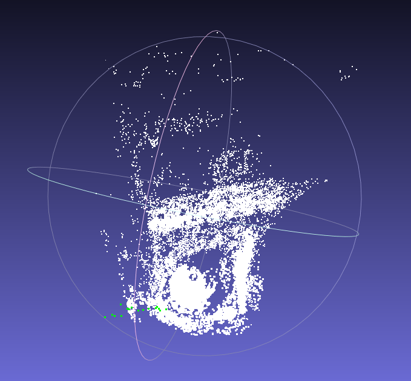

# Structure from Motion

 - This project implements a bundle adjustment framework to find the optimal camera poses and 3D point positions in the [Bundle Adjustment in the Large - BAL Dataset](https://grail.cs.washington.edu/projects/bal/).

## Project Pipeline
 
 - The data of 2D point positions in different camera frames are read and perturbed with noise using the BALProblem class defined in common.cpp.  <br />
 - The optimization has been implemented using both g2o and Ceres. With g2o, graph vertices are created for each landmark point and camera pose to be estimated. <br />
 - Then g2o edges are added between pairs of 3D point and camera pose vertices that produce measurements recorded in the dataset. Reprojection error function is also defined in the g2o edge class. <br />
 - With Ceres, the required residual block template class is defined in SnavelyReprojectionError.h which is a functor that calculates the jacobian directly through auto differentiation. <br />
 - Levenberg–Marquardt optimization algorithm has been set up to perform the estimation. Also due to the large scale of the problem, Schur elimination has been utilized to marginalize the landmark positions and accelerate the calculation of the solution to the normal equation. 

**Initial Model** <br />
 <br />
**Model after Bundle Adjustment** <br />
 <br />

## Dependencies
```
Eigen
Sophus
g2o
Ceres
```